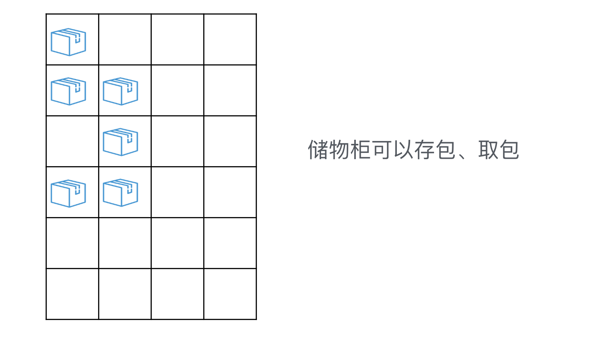
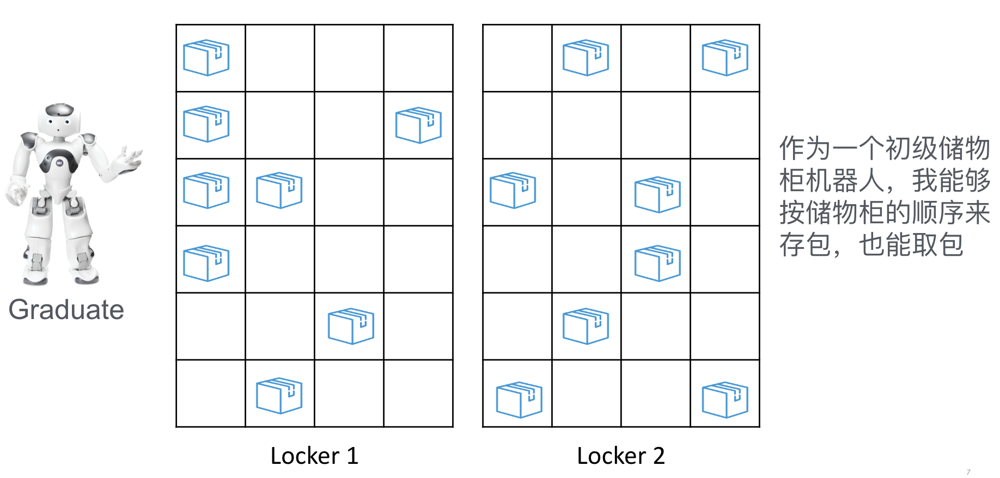

# Locker

```
Given locker

When press save button

Then return a ticket
```
```
Given locker, valid ticket

When press get button and input ticket

Then release target box indicated on ticket
```
```
Given locker, fake ticket

When press get button and input ticket

Then throw InvalidTicketException
```

```
Given full locker

When press save button

Then throw NoEmptyBoxException
```

```
Given locker with two box used

When press save button

Then return ticket with boxId==2
```

```
Given 2 lockers locker1 and locker2, 1 valid ticket of locker1

When press get button and input ticket to locker2

Then throw InvalidTicketException
```

```
# traverse hashMap every time to find empty box is time consuming
# we should use a stack to cache Id of empty box
# need to implemment this optimization and fullfill all previous tests

change expect boxId to 21 for the test before last test (or tricky implementation?)
```

```$xslt
# ticket should be expired after get
Given locker, ticket1 used, ticket2 unused

When press get button and input ticke1

Then throw InvalidTicketException
```

# Primary Locker Robot

```
# check robot save 
Given robot, 1 locker, 

When ask robot save package

Then return ticket
```

```
# check robot get
Given robot, 1 locker, 1 valid ticket

When ask robot get package

Then robot should release the target box accroding to ticket
```

```
# to check robot save order
Given robot, 2 lockers, 1st full and 2nd locker has empty box.

When ask robot to save pkg

Then return ticket with LockerId equals to 2nd locker.
```

```
# to check robot get order
Given robot, 2 lockers, valid ticket of 2nd locker.

When ask robot to save pkg

Then release target box.
```

```
# GREEN TEST for logic completeness
Given robot, 2 lockers, ALL full 

When ask robot to get pkg

Then Throw NoEmptyBoxException.
```
#### Security Check

```
Given locker, valid ticket

When modify boxId on ticket

Then Throw InvalidTicketException
```


## Questions & Thoughts
- Should we keep unnecessary(green) test transfer from task to keep logic completeness?
- Refactor may lead to test fail, should we modify tests or implement trickily.
- TDD brings security issue, for instance public method only used by test may
accidentally used by other class. (accessor method only?)
 